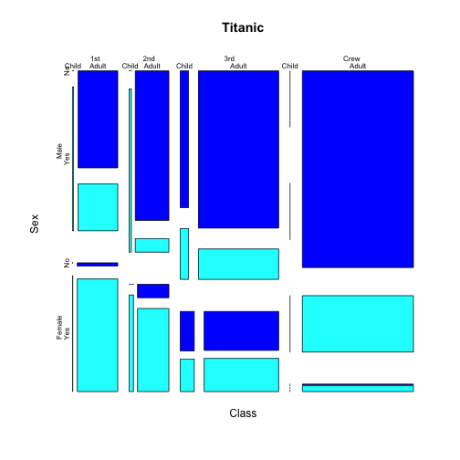

## Reproducible Pitch 'Titanic'

For this assigment, I thought it would be nice to use an other data set then the all too familiar "mtcars" and "HairEyeColor", so I chose "Titanic".

This dataset attributes four categories to all the people who were onboard the Titanic: which class they were in, whether they were male or female, adult or child and whether they survived or not.

The default plot function show all four categories in a so called mosaic plot:

---

## Reproducible Pitch 'Titanic'


```r
data("Titanic")
mosaicplot(Titanic,color = 4:5)
```



---

## Reproducible Pitch 'Titanic'

And although it is a great plot, it can be a little too much to grasp at first sight. So I thought it would be neat to reduce the complexity by showing only two categories at a time. 

Furthermore the user will be able to select the categories.

The mosaicplot function offers a nice feature to select only the categories you wish too see. For instance, let's show the categories "Class" and "Survived":

```
mosaicplot(~ Class + Survived, data = Titanic, color = 4:5)
```

---

## Reproducible Pitch 'Titanic'

Using this function template, I was able to create an interactive plot, where the user can select the categories he/she wishes to see, by pressing one or two radio buttons and the plot is immediately updated with the selected categories.

Check it out on: <a>https://robhofstra.shinyapps.io/Titanic</a>
